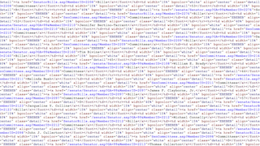
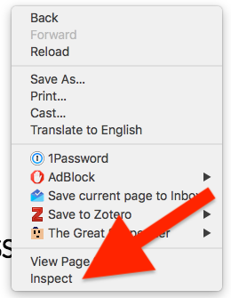

# Source Code for Websites: HTML, CSS, and Javascript

> ### Learning objectives
> 
> * understand enough HTML structure to build a scraper (next week)
> * discern what components of a webpage are relevant to that task (CSS, HTML, Javascript) and which probably are not


## Why HTML?

Understanding the basic structure of HTML (and two other languages often used to customize websites, CSS and Javascript) allows us to: 

- pursue data collection projects that entail webscraping
- improve the design of our own websites (you have one, right?)
- evaluate how best to share our findings with a web-based audience 


## How the Web Works 

Computers connected to the web are **clients** and **servers**.
- Clients: the typical web user's internet-connected devices 
- Servers: computers that store webpages, sites, or apps.

<small>[client-server](https://mdn.mozillademos.org/files/8973/Client-server.jpg)</small>

[The TCP/IP model](https://en.wikipedia.org/wiki/Internet_protocol_suite) has 4 components (for more information, see the post by [Karl Dubost](https://dev.opera.com/articles/http-basic-introduction/)). 

1. **Link** describes the access to physical media (e.g. using the network card)
2. **Internet** describes the envelope and routing of data — how it is packaged (IP)
3. **Transport** describes the way the data is delivered from the starting point to the final destination (TCP, UDP)
4. **Application** describes the meaning or format of the transferred messages (HTTP)

When using an API, we don't need to worry about how web content is organized. Since that information is provided by the API documentation (key-value pairs). As long as you know how HTTP (Hyptertext Transfer Protocol) works, then it's fine. Unfortunately, that's not the case for web scraping. 


[Mozila Foundation](https://developer.mozilla.org/en-US/docs/Learn/HTML/Introduction_to_HTML/Getting_started) have amazing tutorials on Web fundamentals. I use some of their contents for this section. 


## What is a Website?

Some combination of codebase, database

The "front end" product is HTML + CSS stylesheets + Javascript
- HTML: 
  - provides the skeleton of the website (aka, the "tree")
  - starts with call to `<html>` tag, ends with `</html>` tag
  - note that tags are case-sensitive. `<html>` not `HTML`.
- CSS: 
  - fleshes out the website (provides color, shape, styling, etc.)
  - uses *.css files or code embedded in `<style>` `</style>` or `<link>` `</link>` tags
- Javascript:
  - brings the website to life (dynamic or interactive content)
  - *.js files or code embedded in `<script>` `</script>` tags


### This is a Website



Your browser turns that into a tidy layout...


Voila!

## HTML: Basic Structure

```html
<!DOCTYPE html>
<html>
	<head>
		<title>Page title</title>
	</head>
 	<body>
 		<p>Hello world!</p>
 	</body>
</html>
```

### HTML is a Tree


Where else have we seen a tree structure before? 


## Document Object Model

- Most modern browsers have a parser that reads in the HTML document, parses it into a DOM (Document Object Model) structure, and then renders the DOM structure.

- Much like HTTP, the DOM is an agreed-upon standard.

- The DOM is much more than what I've described, but for our purposes, what is most important to understand is that the text is only one part of an HTML element. (This will be important to remember when you get to writing your scrapers next week!)

### Example of a Document Object Model

Note that the DOM retains the tree structure: 


## HTML Elements

Generally speaking, an HTML element has three components:

1. Tags (starts and ends the element)
2. Attributes (gives information about the element)
3. Content (the text/image/etc. *inside* the element)


### HTML: Tags


<small>[Image credit](http://miriamposner.com/blog/wp-content/uploads/2011/11/html-handout.pdf)</small>

Common HTML Tags
========================================================

| Tag        | Meaning           | 
| ------------- |-------------  |
| `<head>`     | page header (metadata, etc | 
| `<body>`     | holds all of the content |
| `<p>` | regular text (paragraph) |
| `<h1>`,`<h2>`,`<h3>` | header text, levels 1, 2, 3  |
| `ol,`,`<ul>`,`<li>` | ordered list, unordered list, list item |
| `<a href="page.html">` | link to "page.html" |
| `<table>`,`<tr>`,`<td>`  | table, table row, table item |
| `<div>`,`<span` | general containers |

### HTML Attributes

- HTML elements can have attributes
- Attributes provide additional information about an element
- Attributes are always specified in the start tag
- Attributes come in name/value pairs like: name="value"


## CSS

- CSS = Cascading Style Sheet. 
- CSS defines how HTML elements are to be displayed
- HTML came first. But it was only meant to define content, not format it. While HTML contains tags like `<font>` and `<color>`, this is a very inefficient way to develop a website.
- To solve this problem, CSS was created to display content on a webpage. Now, one can change the look of an entire website just by changing one file.
- Most web designers litter the HTML markup with tons of `class`s and `id`s to provide "hooks" for their CSS.
- You can piggyback on these to jump to the parts of the markup that contain the data you need.

### CSS Anatomy

* Selectors
    - Element selector: `p`
    - Class selector:  `p class="blue"`
    - I.D. selector: `p id="blue"`

* Declarations
    - Selector: `p`
    - Property: `background-color`
    - Value: `yellow`

* Hooks

***


## CSS + HTML

```html
<body>
	<table id="content">
    	<tr class='name'>
        	<td class='firstname'>
         		Ernesto
        	</td>
        	<td class='lastname'>
          		Rojas
        	</td>
    	</tr>
    	<tr class='name'>
      		<td class='firstname'>
          		Elisabeth
        	</td>
        	<td class='lastname'>
          		Earley
     		</td>
    	</tr>
 	</table>
</body>
```

## Javascript

- Where have we seen Javascript before?
  - .json = **J**ava**s**cript **O**bject **N**otation
  - Note: Javascript and Java are two entirely separate languages
- Javascript is added into existing HTML code (either in head or in body)
- JS adds actions to sites: every time you "interact" with a button, image, or graphic, or you see something change live, you're probably looking at Javascript 

### Javascript Example 1 

Javascript can be added explicitly in code, or by calling a separate script file (.js)
- Added explicitly: 

<small>[Image credit](https://www.w3schools.com/js/js_output.asp)</small>

### Javascript Example 2

Javascript can also be written as a separate script, just like we do with R (and it looks fairly similar!)

```javascript
var x, y;
x = 5;
y = 'string' // This is a string
z = x + y; 
```
What will z print? 

### Return of the Javascript

Javascript can also be used in Qualtrics. 

For now, it's time for a challenge...

## Inspecting website source code 

### Assemble Your Tools

1. Get [Google Chrome](https://www.google.com/chrome/)
2. Get the [Selector Gadget](http://selectorgadget.com/)
    - this is a Chrome extension that lets us select everything on a page of a certain type (typically, by looking for objects of the same class)

### Selector Gadget 

Selector Gadget is a Chrome extension that lets us select everything on a page of a certain type (typically, by looking for objects of the same class). We can use this extension to identify what CSS selectors 


### Inspect Element

Google Chrome comes with great developer tools to help parse a webpage.



The inspector gives you the HTML tree, as well as all the CSS selectors and style information.


### Using tools 

#### Example 1

Let's say that we want to scrape the headings on this page. We would first need to identify the parts of the source code that contain text for headings. 

How would we find the parts of the code for this webpage with heading text? 

First, inspect the source code using Google Crome or an equivilent tool. Use the 'select element' tool to click on the headings. 


What patterns do you see? 

Now, try using the Selector Gadget. Notice how the gadget finds patterns of code that correspond to the selected page elements. 


Now repeat this process for the text of this page. What tags uniquely define the page text?

Lastly, let's change the style for this page using Google's inspect elements tool. How could we change the block quote color to red? What happens when we refresh the page? 


#### Example 2

Go to the webpage for [today's print copy of the Washington Post](https://www.washingtonpost.com/todays_paper/updates/). 

How would we find the parts of the code for this webpage with article titles? What about article authors (bylines)? 

First, inspect the source code using Google Crome or an equivilent tool. Use the 'select element' tool to click on the headings. Then, use the Selector Gadget to finds patterns of code that correspond to the selected page elements. 

Now, let's try the same procedure to identify headlines on the [Washington Post's homepage](https://www.washingtonpost.com/). Would it be easier or harder to identify all headlines on the homepage?  


******************************************

## Challenges

Go to the NYT page for [today's paper](https://www.nytimes.com/section/todayspaper). 

1. What tags uniquely define the byline? What is the CSS selector for the byline? 

2. What tags uniquely define the section headers? Is there a CSS selector for all the section headers?

3. Using the styles tab in your inspector, change all headlines to a "blueviolet" color. Change the page background color to "bisque."

4. (Optional) Change the font size of the summaries to be smaller. Change the font family of the text for the summaries. Then, change it for the entire page.

5. What tags define links to the articles?

6. What is the first instance of Javascript on the webpage?
